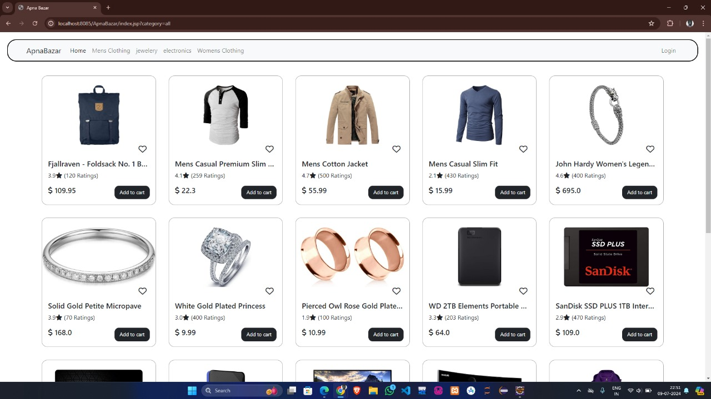

# Apna Bazar

Apna Bazar is an online e-commerce platform that allows users to browse, search, and purchase products seamlessly. The project utilizes a variety of technologies including Java, Bootstrap, JDBC, JSP, SQL, and JavaScript to provide a dynamic and user-friendly experience.

## Technologies Used

- **Java**: Backend logic and server-side processing.
- **Bootstrap**: Responsive design and front-end framework.
- **JDBC**: Database connectivity.
- **JSP (JavaServer Pages)**: Dynamic web page generation.
- **SQL**: Database management.
- **JavaScript**: Client-side scripting and interactivity.

## Features

- User registration and login
- Product search and filtering
- Shopping cart management
- Order processing
- Admin panel for managing products and orders

## Installation

Follow these steps to set up the project locally.

### Prerequisites

- Java Development Kit (JDK)
- Apache Tomcat server
- MySQL or any other SQL database
- An IDE like IntelliJ IDEA or Eclipse

### Steps

1. **Clone the Repository**:
    ```bash
    git clone https://github.com/your-username/apna-bazar.git
    cd apna-bazar
    ```

2. **Setup Database**:
    - Create a new database named `apna_bazar`.
    - Import the provided SQL script to create tables and insert initial data.
    ```sql
    -- Example SQL script to create tables and insert data
    CREATE DATABASE apna_bazar;
    USE apna_bazar;

    CREATE TABLE users (
        id INT AUTO_INCREMENT PRIMARY KEY,
        username VARCHAR(50) NOT NULL,
        password VARCHAR(50) NOT NULL,
        email VARCHAR(100) NOT NULL
    );

    CREATE TABLE products (
        id INT AUTO_INCREMENT PRIMARY KEY,
        name VARCHAR(100) NOT NULL,
        description TEXT,
        price DECIMAL(10, 2) NOT NULL,
        stock INT NOT NULL
    );

    -- Add more tables and initial data as needed
    ```

3. **Configure JDBC**:
    - Update the `db.properties` file with your database configuration.
    ```properties
    db.url=jdbc:mysql://localhost:3306/apna_bazar
    db.username=root
    db.password=yourpassword
    ```

4. **Deploy on Tomcat**:
    - Copy the project files to the Tomcat `webapps` directory.
    - Start the Tomcat server and deploy the application.

5. **Access the Application**:
    - Open your web browser and navigate to `http://localhost:8080/apna-bazar`.

## Screenshots

Here are some screenshots of the application:

### Home Page


## Contributing

If you'd like to contribute to this project, please fork the repository and create a pull request. We welcome all contributions that improve the application.

